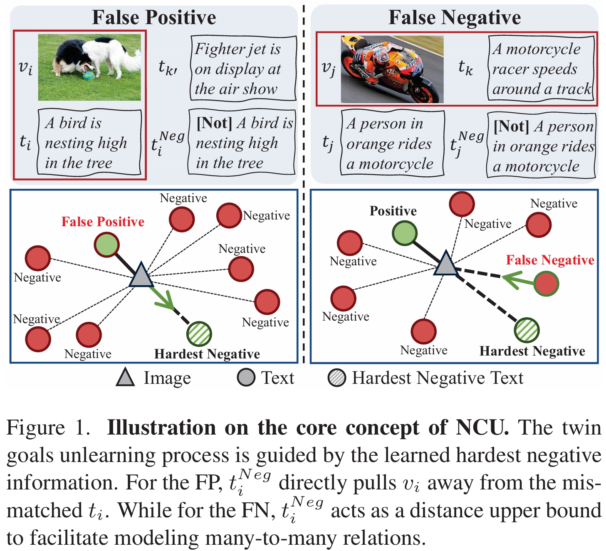

This repository contains the official PyTorch implementation of the following paper:

## Overview
<h1 align="center"></h1>

> **Unlearning the Noisy Correspondence Makes CLIP More Robust**<br>
> Haochen Han, Alex Jinpeng Wang, Peijun Ye, Fangming Liu.<br>
> [https://arxiv.org/abs/2507.03434](https://arxiv.org/abs/2507.03434)
>
> **Abstract:** *The data appetite for Vision-Language Models (VLMs) has continuously scaled up from the early millions to billions today, which faces an untenable trade-off with data quality and inevitably introduces Noisy Correspondence (NC) samples. Undoubtedly, such semantically unrelated data significantly impairs the performance of VLMs. Previous efforts mainly address this challenge by estimating refined alignment for more precise guidance. However, such resource-intensive pipelines that train VLMs from scratch struggle to meet realistic data demands. In this paper, we present a brand new perspective that seeks to directly eliminate the harmful effects of NC in pre-trained VLMs. Specifically, we propose NCU, a Noisy Correspondence Unlearning fine-tuning framework that efficiently enhances VLMs' robustness by forgetting learned noisy knowledge. The key to NCU is learning the hardest negative information, which can provide explicit unlearning direction for both false positives and false negatives. Such twin goals unlearning process can be formalized into one unified optimal transport objective for fast fine-tuning. We validate our approach with the prevailing CLIP model over various downstream tasks. Remarkably, NCU surpasses the robust pre-trained method on zero-shot transfer while with lower computational overhead.*

## Preparation
### Training Data
Unlearning dataset, which can be the total or a partial subset of the pre-training data.  The training CSV file should have 2 columns containing captions and the paths to corresponding images on the machine. For example:
| image_path | text_content | 
|--------|-------------|
| cc3m/train/000000000.jpg | a river has burst its banks and has spread out onto arable farmland alongside | 
|......|......|

We suggest downloading the raw image-caption data from HuggingFace: [CC3M](https://huggingface.co/datasets/pixparse/cc3m-wds), [CC12M](https://huggingface.co/datasets/pixparse/cc12m-wds), and [YFCC15M-R](https://huggingface.co/datasets/Kaichengalex/YFCC15M).

### Evaluation Data
Image classification and cross-modal retrieval data. For classification tasks like ImageNet1K, there should be a labels.csv in the test data directory containing 2 columns -- image and label. The image column should contain the local file paths to the images. For example:
| image | label | 
|--------|-------------|
| ImageNet1K/ILSVRC2012_val_00000001.JPEG | 65 | 
|......|......|

The classification task should also have a corresponding classes.py, containing a dict with "classes" and "templates".

For retrieval tasks, there should be a CSV containing 2 columns -- image and caption. The image column should contain the local file paths to the images. For example:
| image | caption | 
|--------|-------------|
| images_mscoco_2014_5k_test/COCO_val2014_000000391895.jpg | A man with a red helmet on a small moped on a dirt road.  | 
|......|......|

### Pre-trained Models
For example, you can use the [CLIP ViT-B/16 model](https://www.dropbox.com/scl/fi/tulgtm67q1ldddj2nffo6/cc12m_clip.pt?rlkey=lrnxej77ftdzndj6rtd1gakhf&dl=0) pretrained on CC12M from the Internet, and use our NCU to fine-tune it on CC12M to enhance its effectiveness and robustness.

## Training
Remember to replace the data and model weight paths.
```
python -m src.main \
  --name NCU_CC3M \
  --batch_size 2048 \
  --train_data /home/NCU/data/cc3m/train.csv \
  --eval_data_type ImageNet1K \
  --eval_test_data_dir /home/NCU/data/ImageNet1K/validation \
  --image_key image_path \
  --caption_key text_content \
  --device_ids 0 1 2 3 4 5 6 7 8 9 10 11 12 13 14 15 \
  --model_name CLIP_VITB16 \
  --checkpoint /mnt/hanhc/NCU/pretrained_model/LaCLIP_Provided/vitb16_cc3m_clip.pt \
  --lr_UL 5e-5 \
  --lr_pre 1e-4 \
  --epochs 10 \
  --lr_HN 3e-4 \
  --NC_ratio 0.1 \
  --weight_decay 0.2 \
  --weight_decay_prompt 0.2 \
  --distributed
```
## Testing 
### Image Classification
```
python -m src.main \
  --name eval_NCU_EuroSAT \
  --eval_data_type EuroSAT \
  --eval_test_data_dir /mnt/hanhc/CyCLIP/data/EuroSAT/test \
  --batch_size 512 \
  --device_ids 1 \
  --num_workers 4 \
  --checkpoint /mnt/hanhc/CyCLIP/logs/NCU_CC3M/checkpoints/epoch_5.pt \
  --distributed
```
### Cross-modal Retrieval
```
python -m utils.retrieval \
  --name eval_NCU_Flickr30k \
  --input_file data/Flickr30K/test/flickr30k.csv \
  --image_key image \
  --caption_key caption \
  --checkpoint /mnt/hanhc/CyCLIP/logs/NCU_CC3M/checkpoints/epoch_5.pt \
```

## Acknowledgements
Some portions of the code in this repository are adaptations from the following repositories: [CyCLIP](https://github.com/goel-shashank/CyCLIP/tree/main) and [LaCLIP](https://github.com/LijieFan/LaCLIP).
