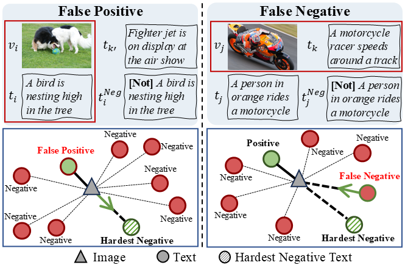

This repository contains the official PyTorch implementation of the following paper:
<h1 align="center"></h1>

> **Unlearning the Noisy Correspondence Makes CLIP More Robust** 
> Haochen Han, Alex Jinpeng Wang, Peijun Ye, Fangming Liu. 
> [https://arxiv.org/abs/2507.03434](https://arxiv.org/abs/2507.03434)
>
> **Abstract:** *The data appetite for Vision-Language Models (VLMs) has continuously scaled up from the early millions to billions today, which faces an untenable trade-off with data quality and inevitably introduces Noisy Correspondence (NC) samples. Undoubtedly, such semantically unrelated data significantly impairs the performance of VLMs. Previous efforts mainly address this challenge by estimating refined alignment for more precise guidance. However, such resource-intensive pipelines that train VLMs from scratch struggle to meet realistic data demands. In this paper, we present a brand new perspective that seeks to directly eliminate the harmful effects of NC in pre-trained VLMs. Specifically, we propose NCU, a Noisy Correspondence Unlearning fine-tuning framework that efficiently enhances VLMs' robustness by forgetting learned noisy knowledge. The key to NCU is learning the hardest negative information, which can provide explicit unlearning direction for both false positives and false negatives. Such twin goals unlearning process can be formalized into one unified optimal transport objective for fast fine-tuning. We validate our approach with the prevailing CLIP model over various downstream tasks. Remarkably, NCU surpasses the robust pre-trained method on zero-shot transfer while with lower computational overhead.*

## Acknowledgements
Some portions of the code in this repository are adaptations from the following repositories: [CyCLIP](https://github.com/goel-shashank/CyCLIP/tree/main) and [LaCLIP](https://github.com/LijieFan/LaCLIP).
